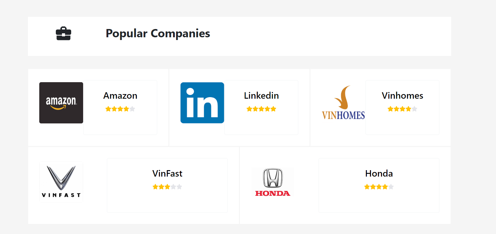
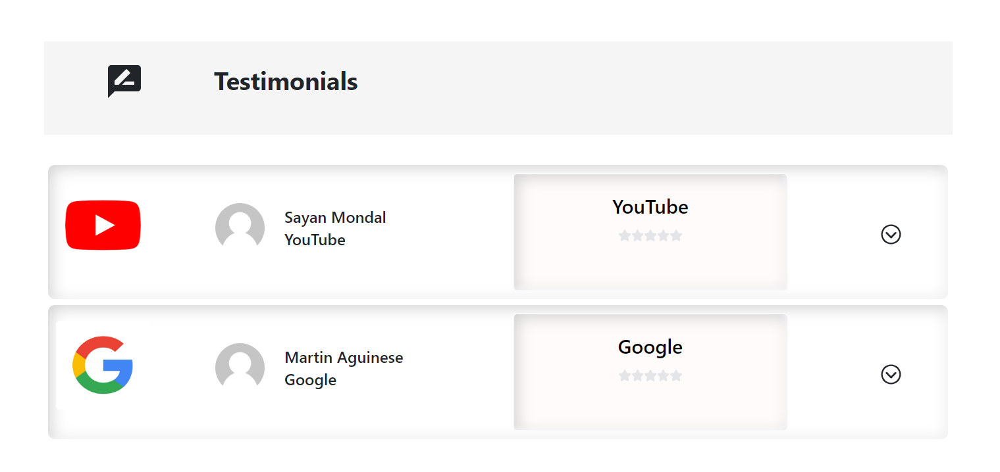

# Marcomjobs

Marcomjobs is a job seekers platform assisting Vietnamese and Indian people to look for jobs as well as Job-related activities like Career Tips, Job Reviews, Educational Communities, etc

### What is the use of this Repo
This Project is a Job Seeker Assistant Project for both Vietnamese as well as Indian Job Seekers which demonstrates the following
With the help of this project, users can:
* Find Company Reviews provided by users
* Users can search and apply for Jobs
* Users can save their favourite jobs
* Users will be able to give testimonials
* Users can be subscribed to a newsletter keeping them up to date with the latest jobs
* Users can view Career Tips from Experts at Marcomjobs
* Users can be a part of Educational Community in Vietnam as well as India

## Live Application URL
#### https://marcomjobs.netlify.com/
This URL has the application deployed in Netlify

## Screenshots
  

  


## Prerequisites
Install Node JS
Refer to https://nodejs.org/en/ to install nodejs

## Install create-react-app
Install `create-react-app` npm package globally. This will help to easily run the project and also build the source files easily. Use the following command to install create-react-app
```
npm install -g create-react-app
```

## Live Application URL
The Application is deployed in https://aditya-sridhar.github.io/simple-reactjs-app

###### Click on the link to see the application

## Cloning and Running the Application in local
**Clone the project into local**

Install all the npm packages. Go into the project folder and type the following command to install all npm packages
```
npm install
```
In order to run the application Type the following command
```
npm start
```
The Application Runs on localhost:**3000**

# Resources
**create-react-app** : The following link has all the commands that can be used with create-react-app https://github.com/facebook/create-react-app

**ReactJS** : Refer to https://reactjs.org/ to understand the concepts of ReactJS

**React Bootstrap** : Refer to https://react-bootstrap.github.io/getting-started/introduction/ to understand how to use React Bootstrap
